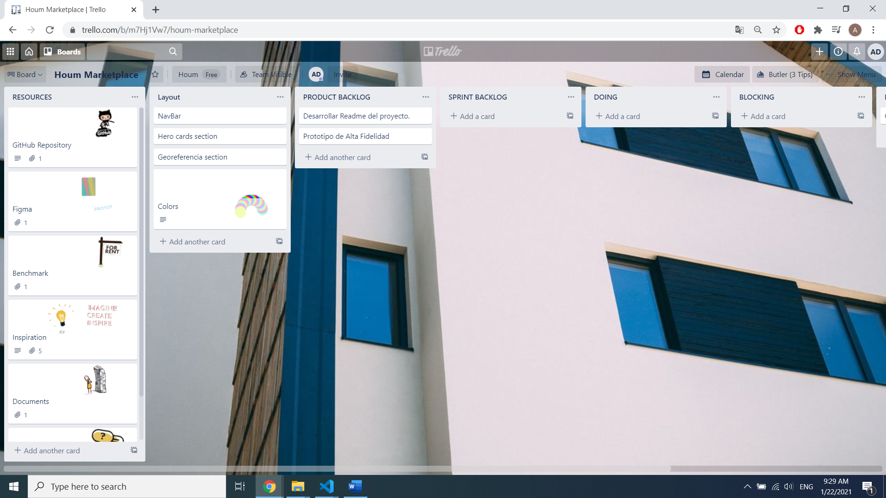
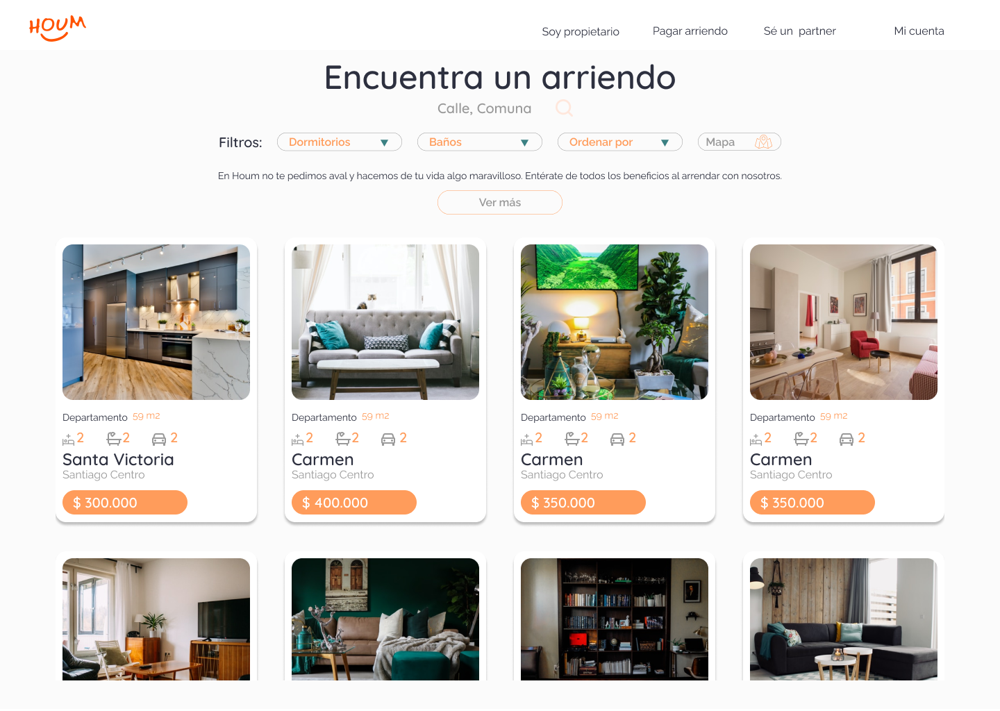
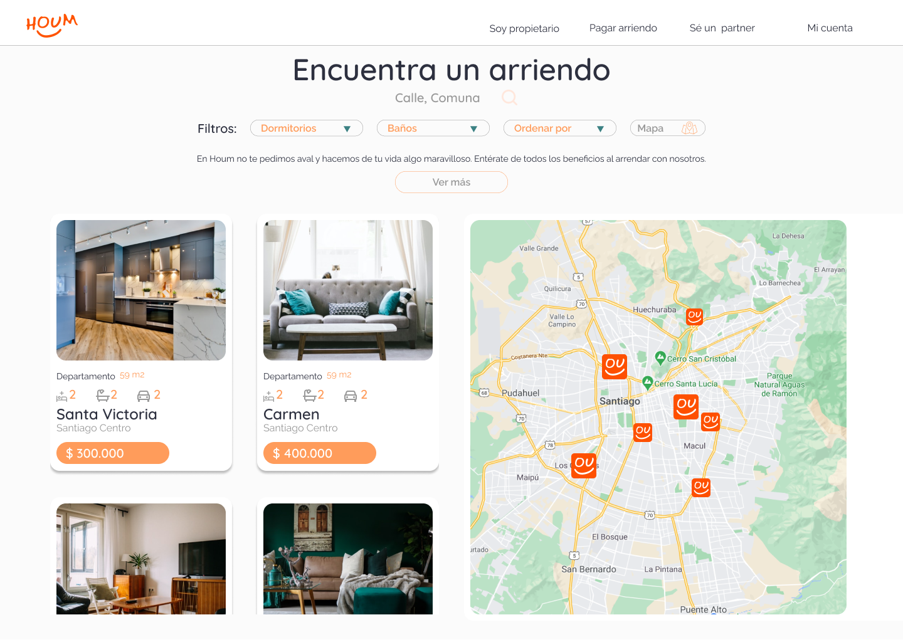
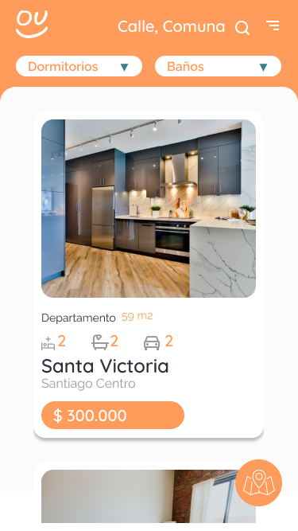

# Marketplace

[Marketplace](https://adbarquitectura.github.io/marketplace/)

## Índice

* [1. Resumen del proyecto](#1-resumen-del-proyecto)
* [2. Planificación](#2-planificación)
* [3. Prototipo](#3-Prototipo)

***

## 1. Resumen del proyecto

Propuesta de rediseño del espacio [marketplace](https://houm.com/propiedades/arriendo/), donde los usuarios podran buscar propiedades en arriendo desde la comodidad de sus hogares.

## 2. Planificación

Utilizando la herramienta Trello, se planificaron todos las issuesy milestones necesarios para desarrollar la propuesta durante 4 días.

[Trello proyecto](https://trello.com/b/m7Hj1Vw7)

## 2. Prototipo

Para esta propuesta se crea prototipo de alta fidelidad en Figma.

[Figma](https://www.figma.com/file/wQBhob6bOl9BOzyfRhnnLG/HOUM-Marketplace?node-id=0%3A1)

[Protootipo interactivo Desktop](https://www.figma.com/proto/wQBhob6bOl9BOzyfRhnnLG/HOUM-Marketplace?node-id=0%3A3&scaling=min-zoom)

[Prototipo interactivo Mobile](https://www.figma.com/proto/wQBhob6bOl9BOzyfRhnnLG/HOUM-Marketplace?node-id=26%3A1&scaling=scale-down)
